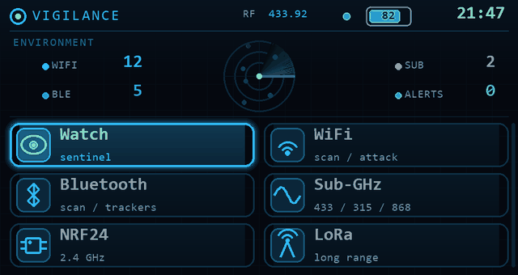

<p align="center">
  
</p>

<h1 align="center">Vigilance</h1>

<p align="center">
  <b>A defensive surveillance HUD firmware for the LilyGo T-Embed CC1101 Plus.</b><br>
  Spot hidden cameras, catch trackers tailing you, and watch the RF around you, on a pocket device.
</p>

<p align="center">
  <a href="https://th3-priest.github.io/vigilance/"></a>
  
  
</p>

> Vigilance is a fork of [**Bruce**](https://github.com/pr3y/Bruce) (AGPL-3.0) by pr3y and contributors, with a merge of work from **Sor3nt**. It keeps Bruce's toolbox and rebuilds the experience around one idea: a coherent defensive watch station, not a pile of menus. See [Credits](#credits) and [NOTICE](NOTICE).

---

## Why Vigilance

Most ESP32 security firmwares look and feel like a debug console. Vigilance ships a real interface: a **framebuffer HUD** rendered with anti-aliased primitives, so it reads like a product instead of a terminal.

- **Sentinel HUD home screen** with a **live radar** that passively scans the WiFi around you and shows real contacts as they appear.
- **Standby scene** (like a Flipper dolphin, but a sentinel eye inside a radar) that reacts to the threat level and doubles as a screensaver.
- **Clean lock-on boot** and one visual language across every screen, retintable through built-in themes.

## Defensive features

Vigilance leads with the tools that protect you. It is built for finding surveillance, not just doing it.

- **Bug Sweep** — flags likely WiFi cameras and recorders nearby (by SSID pattern and vendor OUI), to check a hotel room or an Airbnb before you settle in. Passive, no transmission.
- **BLE Watch (anti-tracker)** — detects AirTag / SmartTag / Tile / Chipolo style trackers and warns when one has been following you across time.
- **Tail Watch** — learns the RF "zones" you move through and raises a flag when the same device reappears zone after zone, the signature of someone tailing you.
- **Deauth detection** — Watch Mode alerts on WiFi deauthentication attacks in your area.
- **Sub-GHz Census** — passively catalogs the 433 / 315 / 868 MHz devices broadcasting around you.
- **Journal** — an on-device timeline of every alert, colour coded by severity.
- **Guardian Eye** and **Sentinel Pulse** — an ambient threat indicator on screen and on the RGB LED.
- **Swarm** — link several units over ESP-NOW to cover more ground together.

It also inherits Bruce's full offensive and RF toolkit (Sub-GHz, NFC/RFID, IR, 2.4 GHz NRF, WiFi, BLE, GPS, scripting, web UI). Use it responsibly, see [Legal](#legal).

## Hardware

Built and tested for the **LilyGo T-Embed CC1101 Plus** (ESP32-S3, 16 MB flash / 8 MB PSRAM, ST7789 320x170 display, rotary encoder + button, CC1101, WS2812 LED). Other Bruce-supported boards may build, but the HUD is tuned for this one.

## Install

### Easiest: flash from your browser

1. Open **https://th3-priest.github.io/vigilance/** in Chrome or Edge (desktop).
2. Plug the T-Embed in over USB-C.
3. Click **Connect**, pick the serial port, and let it flash.

Web Serial only works in Chromium browsers (Chrome, Edge, Brave, Opera). Firefox and Safari are not supported for flashing.

### Manual (esptool)

Download `vigilance-t-embed-cc1101.bin` from the [latest release](https://github.com/Th3-Priest/vigilance/releases), then:

```bash
esptool.py --chip esp32s3 --port <PORT> --baud 921600 write_flash 0x0 vigilance-t-embed-cc1101.bin
```

`<PORT>` is like `COM7` on Windows or `/dev/ttyACM0` on Linux. The `.bin` is a merged image, so it flashes at offset `0x0`.

## Build from source

Requires [PlatformIO](https://platformio.org/).

```bash
git clone https://github.com/Th3-Priest/vigilance.git
cd vigilance
pio run -e lilygo-t-embed-cc1101
# merged image ends up in .pio/build/lilygo-t-embed-cc1101/firmware.factory.bin
```

## Swarm satellite

Vigilance can coordinate several units over ESP-NOW. The watch is the master;
cheap **ESP32-C3** boards run a lightweight satellite firmware and extend your
coverage (each node scans, listens or measures on command and reports back). The
satellite lives in [`satellite/`](satellite/) and has its own PlatformIO project:

```bash
cd satellite
pio run -e esp32-c3 -t upload
```

Or flash it from the browser with the "Flash a satellite" button on the
[web flasher](https://th3-priest.github.io/vigilance/).

## Roadmap

Vigilance is under active development with a long feature backlog (Swarm V2 mesh, ambient census expansions, more defensive detectors, mission profiles, theming). Watch the repo and releases to follow along.

## Credits

Vigilance stands on the shoulders of the people who built the ecosystem:

- **[Bruce](https://github.com/pr3y/Bruce)** by pr3y and its contributors, the base firmware. AGPL-3.0.
- **Sor3nt**, whose work is merged in.
- The many upstream libraries listed in [THIRD_PARTY.md](THIRD_PARTY.md).

If you like what Vigilance does, please also star and support the upstream Bruce project.

## Legal

Vigilance includes tools that can transmit and probe radio and network protocols. Using them against systems, networks, or radios you do not own or are not explicitly authorised to test may be illegal in your country. This firmware is provided for education, research, and authorised security testing only. You are solely responsible for how you use it. The authors accept no liability for misuse.

## License

Vigilance is released under the **GNU Affero General Public License v3.0**, the same license as Bruce. See [LICENSE](LICENSE). Because Vigilance is a derivative work, it stays AGPL-3.0 and its source is available here.
